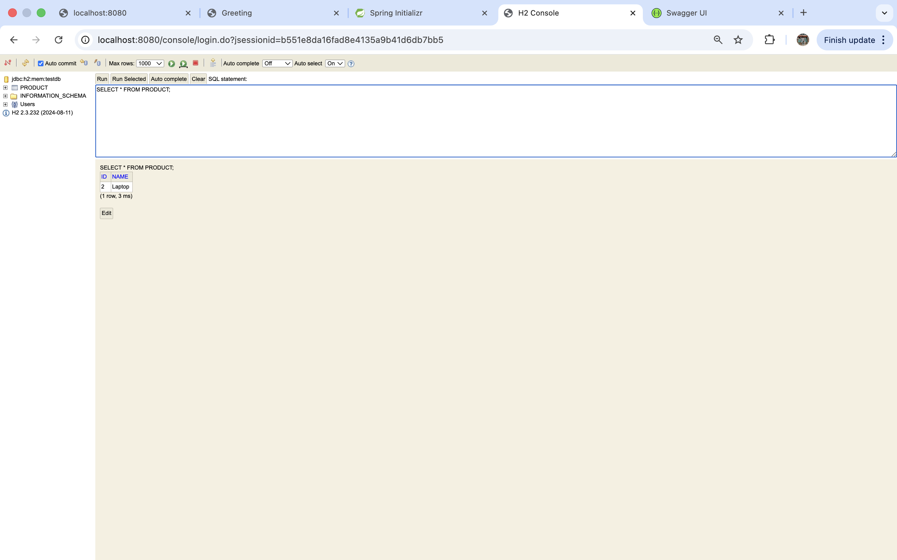

# Task 2 – Spring Boot REST API (Products)

## Project Description
This project is a Spring Boot REST API that manages products.
It supports full CRUD operations and uses an H2 in-memory database.
All API endpoints are tested using Swagger UI as required.

---

## Technologies Used
- Java
- Spring Boot
- Spring Web
- Spring Data JPA
- H2 Database
- Swagger / OpenAPI

---

## How to Run the Project
1. Open the project in IntelliJ IDEA
2. Run the application using `Task2Application`
3. Application starts at: http://localhost:8080
---

## Swagger UI
Swagger UI is used to test all REST endpoints.

Open: http://localhost:8080/swagger-ui/index.html

### Swagger Overview

---

## API Use Cases (Swagger)

### Get All Products
**GET** `/api/v1/products`

---

### Create Product
**POST** `/api/v1/products`

---

### Update Product
**PUT** `/api/v1/products/{id}`

---

### Delete Product
**DELETE** `/api/v1/products/{id}`

---

## H2 Database Console

The application uses an H2 in-memory database.

Open: http://localhost:8080/h2-console

**Login details:**
- JDBC URL: `jdbc:h2:mem:testdb`
- Username: `sa`
- Password: (empty)

### H2 Login Screen

---

### H2 Database View

---

### Product Table Data

SQL query:

